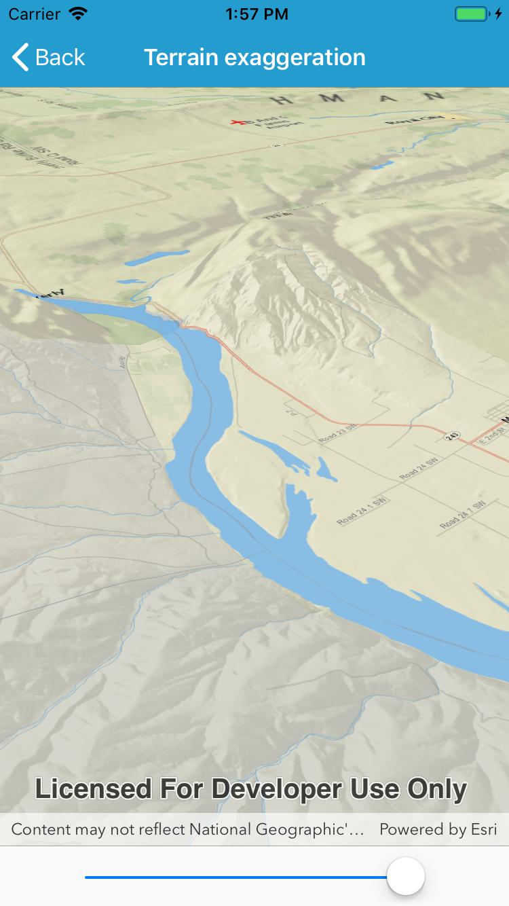

# Terrain exaggeration

Configure the vertical exaggeration of terrain (the ground surface) in a scene.

## How to use the sample

Use the slider to update terrain exaggeration.

## How it works

1. Create an elevation source and add it to a new surface.
2. Add the surface to the scene.
3. Configure the surface's elevation exaggeration.

## Relevant API

* Scene
* Surface
* Scene.BaseSurface
* Surface.ElevationExaggeration

## Tags

Elevation, terrain, DTM, DEM, surface, 3D, scene
