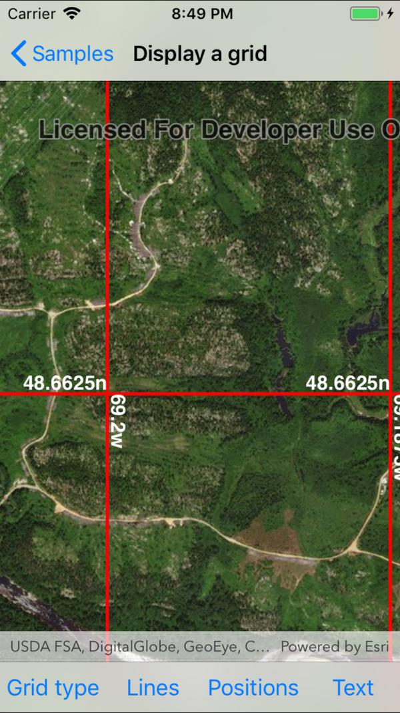

# Display a grid

This sample demonstrates how to display and work with coordinate grid systems such as Latitude/Longitude, MGRS, UTM and USNG on a map view. This includes toggling labels visibility, changing the color of the grid lines, and changing the color of the grid labels.

## Instructions

Use the buttons in the toolbar to change grid settings. Changes take effect immediately.
