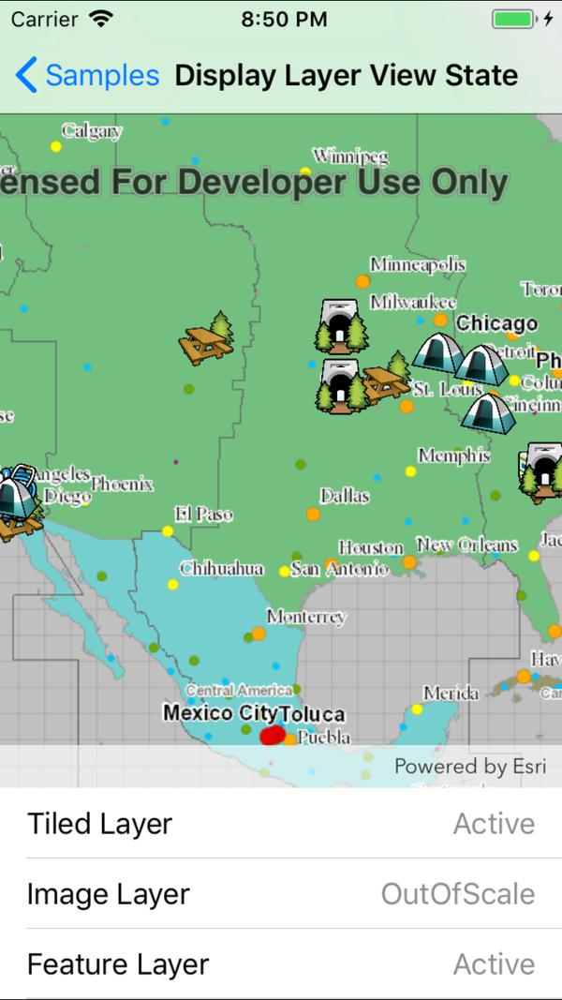

# Display layer view state

View the status of the layers on the map.

## How to use the sample

Pan and zoom on the map to view changes in status.

## How it works

1. The layer view state is obtained from the enum value of `LayerViewStatus`.
2. Listen for the `LayerViewStateChanged` event.

## Relevant API

* Map
* MapView

## Tags

MapViews, layer, status, view state
