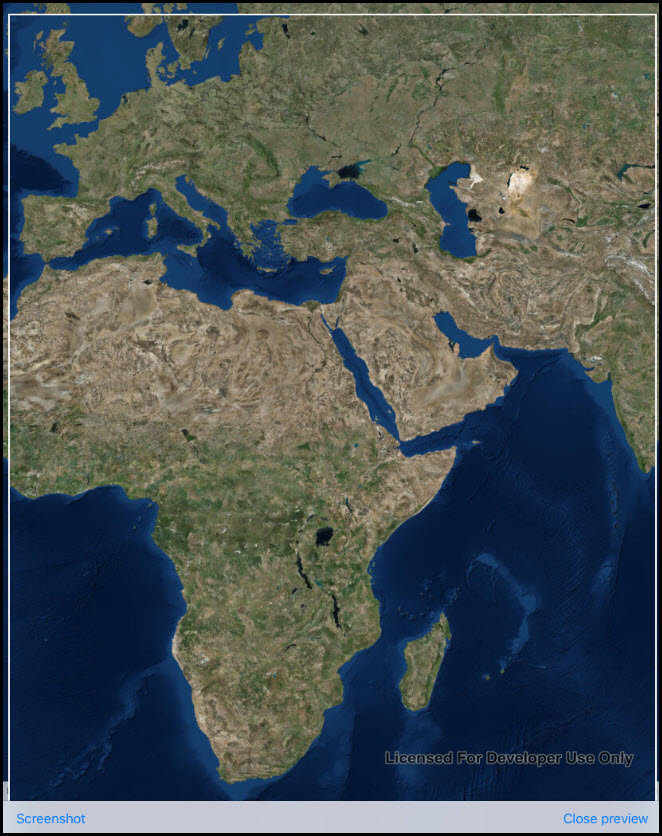

#Take Screenshot

This sample demonstrates how you can take screenshot of a map. The app has a Screenshot button in the bottom toolbar you can tap to take screenshot of the visible area of the map. You can pan or zoom to a specific location and tap on the button, which also shows you the preview of the image produced. You can tap on the Close Preview button to close image preview.

### Instructions

