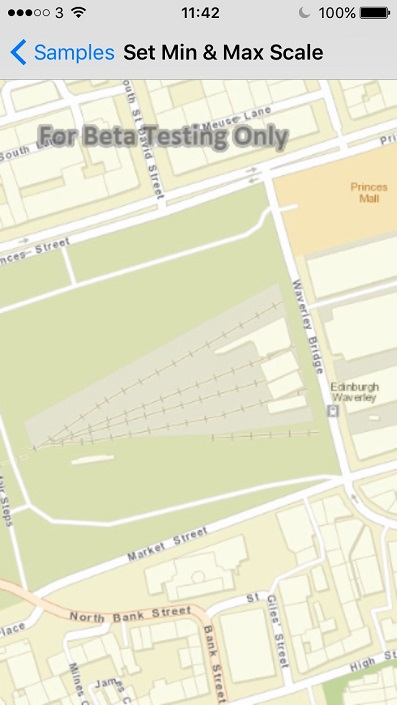

# Set Min & Max Scale

This sample demonstrates how to set the minimum and maximum scale of a MapsAndVisualization. Setting the minimum and maximum scale for the MapsAndVisualization can be useful in keeping the user focused at a certain level of detail.

