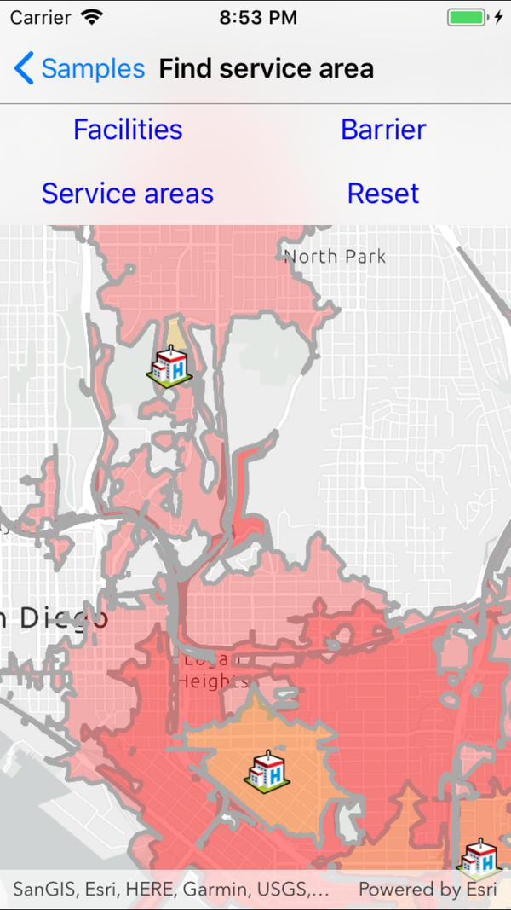

# Find service area

Find the service area within a network from a given point.

## Use case

A service area shows locations that can be reached from a facility based off a certain impedance, such as travel time or distance. Barriers can increase impedance by either adding to the time it takes to pass through the barrier or by altogether preventing passage.

You might calculate the region around a hospital in which ambulances can service in 30 min or less.

## How to use the sample

* To add a facility or barrier, click '+', then choose facility or barrier, and tap the map to place it. When placing a barrier, tap multiple points to draw a line between them, then click 'Done'.
* To show service areas around facilities that were added, click 'Solve'.
* The reset button clears all graphics and resets the service area task.

## How it works

1. Create a new `ServiceAreaTask` from a network service.
2. Create default `ServiceAreaParameters` from the service area task.
3. Set the parameters to return polygons (true) to return all service areas.
4. Add a `ServiceAreaFacility` to the parameters.
5. Get the `ServiceAreaResult` by solving the service area task using the parameters.
6. Get any `ServiceAreaPolygons` that were returned.
7. Display the service area polygons as graphics in a `GraphicsOverlay` on the `MapView`.

## Relevant API

* PolylineBarrier
* ServiceAreaFacility
* ServiceAreaParameters
* ServiceAreaPolygon
* ServiceAreaResult
* ServiceAreaTask

## Tags

Routing and Logistics, barriers, facilities, impedance
