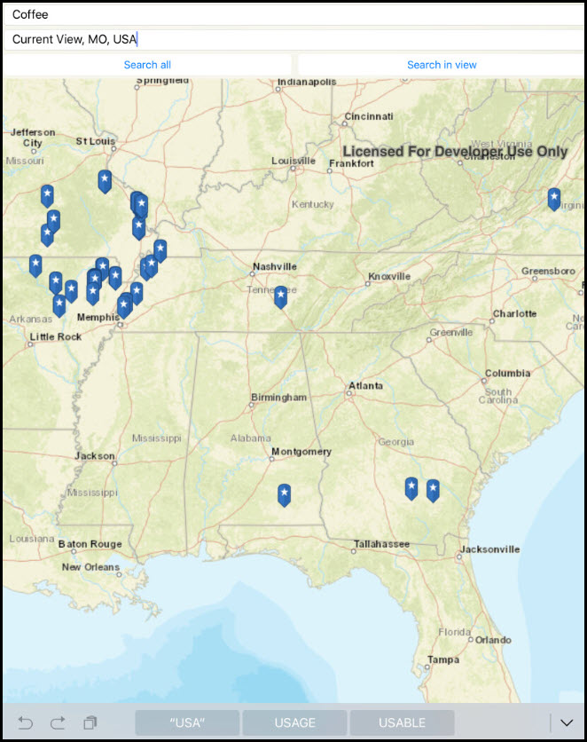

# Find place

This sample demonstrates how to use geocode functionality to search for points of interest, around a location or within an extent.

## Instructions

1. Enter a point of interest you'd like to search for (e.g. 'Starbucks')
2. Enter a search location or accept the default 'Current Location'
3. Select 'search all' to get all results, or press 'search view' to only get results within the current extent.
