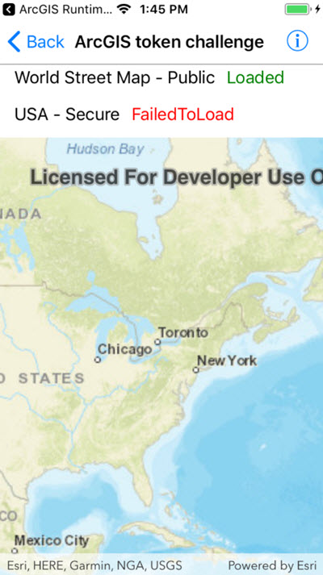

# ArcGIS token challenge

This sample demonstrates how to prompt the user for a username and password to authenticate with ArcGIS Server to access an ArcGIS token-secured service. Accessing secured services requires a login that's been defined on the server.

## Use case

Your app may need to access services that are restricted to authorized users. For example, your organization may host ArcGIS services that are only accessible by verified users.

## How to use the sample

When you run the sample, the app will load a map that contains a layer from a secured service. Then, you will be challenged for a user name and password to view that layer. Enter the correct user name (user1) and password (user1). If you authenticate successfully, the secured layer will display, otherwise the map will contain only the public layers.

## How it works

1. A custom `ChallengeHandler` is set for `AuthenticationManager` that displays a login dialog for entering a username and password.
2. In response to the attempt to access secured content, the `AuthenticationManager` calls the challenge handler.
3. A `TokenCredential` is created from the entered username and password, and an attempt is made to load the layer.

## Relevant API

* AuthenticationManager
* TokenCredential

## Additional information

Please note: the username and password are case sensitive for token-based authentication. If the user doesn't have permission to access all the content within the portal item, partial or no content will be returned.

## Tags

authentication, cloud, portal, remember, security