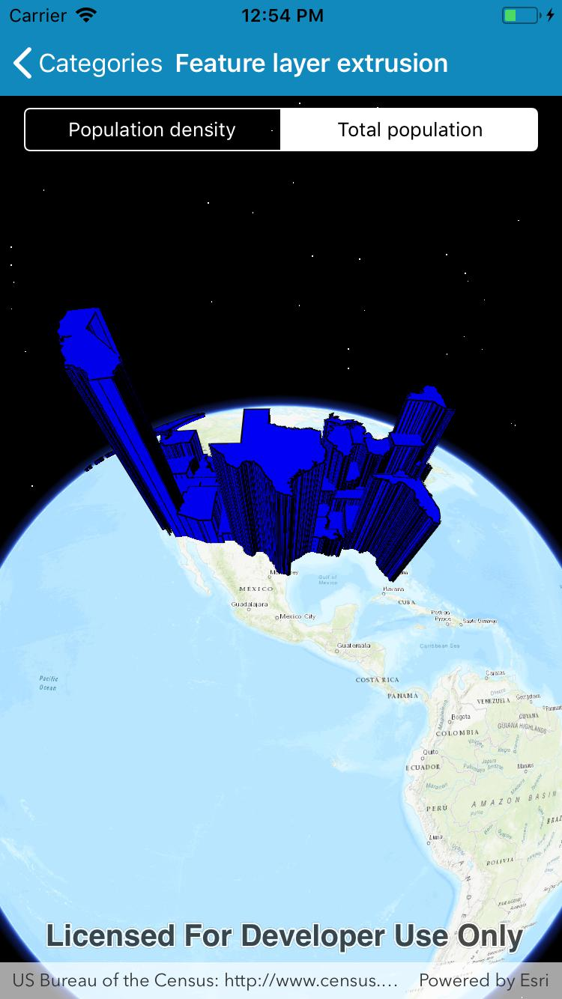

# Feature layer extrusion

Extrude features based on their attributes.

## Use case

Extrusion is a method of visualizing data. For example, it can be employed to demonstrate
the relative population difference between US states.

## How it works

1. Create a `ServiceFeatureTable` from a URL.
2. Create a feature layer from the service feature table.
    * Make sure to set the rendering mode to dynamic.
3. Apply a `SimpleRenderer` to the feature layer.
4. Set `ExtrusionMode` of render, `renderer.SceneProperties.ExtrusionMode = SceneProperties.ExtrusionMode.BaseHeight`.
5. Set extrusion expression of renderer, `renderer.SceneProperties.ExtrusionExpression = "[POP2007]/ 10"`.

## Relevant API

* FeatureLayer
* FeatureLayer
* SceneProperties
* ServiceFeatureTable

## Tags

3D, ExtrusionExpression, ExtrusionMode, Scene, SimpleRenderer, extrude
