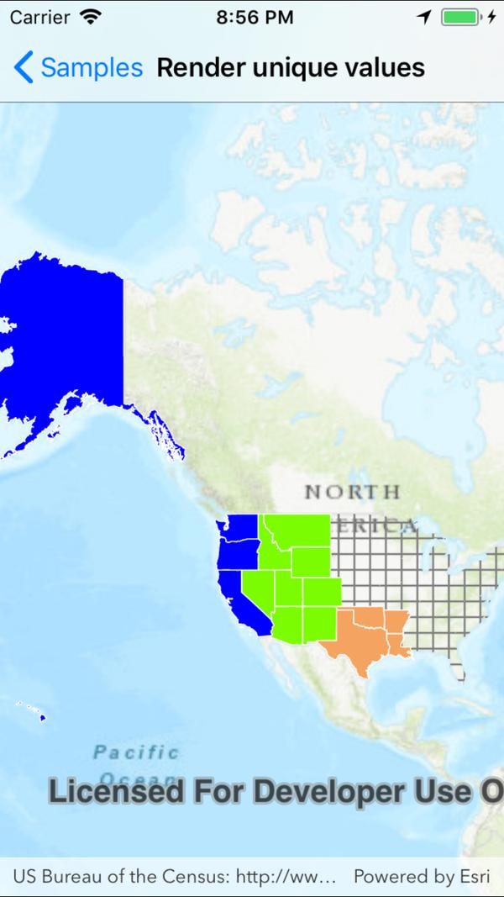

# Unique value renderer

This sample demonstrate how to use a unique value renderer to style different features in a feature layer with different symbols. Features do not have a symbol property for you to set, renderers should be used to define the symbol for features in feature layers. The unique value renderer allows for separate symbols to be used for features that have specific attribute values in a defined field.

