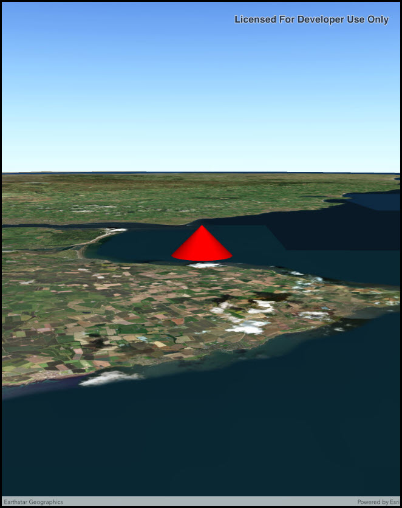

# Distance composite symbol

This sample demonstrates how to create a `DistanceCompositeSceneSymbol` with unique marker symbols to display at various distances from the camera.

## Instructions

1. When the Scene initially loads, you will be looking at a point graphic symbolized with a 3D model symbol (airplane).
2. Zoom away slightly from the graphic and the symbol will change to a blue 3D cone symbol (pointing in the direction of flight).
3. Zoom farther from the graphic and the symbol will change to a blue circle marker symbol.
